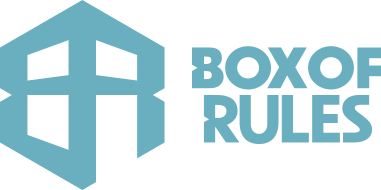

<p align="center">
  <a href="https://boxofrules.com?utm_source=github&utm_medium=readme&utm_campaign=assets"></a>
</p>

# @boxofrules/assets

[](https://boxofrules.com/support?utm_source=github&utm_medium=readme&utm_campaign=assets)
[](https://www.paypal.com/donate/?hosted_button_id=25AW3DJVM8FPJ)
[](https://www.patreon.com/BoxOfRules)
[](https://ko-fi.com/Z7I0211Q00)

**Every approved Box Of Rules asset, in one place, with a manifest that says what each one is and where it goes.** Logos for Box Of Rules and each product, the fonts, the colour and type tokens, favicon sets, and every picture of every plugin at every shipped version. If you are putting a Box Of Rules logo or plugin image on a page, a listing, a README, a post or an email, it comes from here. Nothing is drawn, cropped, recoloured or "approximated": `manifest.json` names the file for the job.

The same files are served from **https://cdn.boxofrules.com** (see below), so you do not need npm to use them.

## What is in it

```
marks/<product>/        logos: full, icon, logotype, card, as SVG + transparent PNG (1024 px long edge)
products/plugins/<slug>/<version>/   that release's pictures, never changed once published
products/plugins/<slug>/latest/      a copy of the current release: the folder to link
fonts/                  Syne (variable), Barlow 400 to 700, Unbounded 700, as woff2, with their OFL texts
css/tokens.css          colours, type and per-product scopes as CSS custom properties
css/fonts.css           the @font-face rules for fonts/
tokens.json             the same tokens for scripts, og-card builders and docs
web/<product>/          favicon.ico/svg/png, apple-touch-icon, PWA icons, site.webmanifest, head.html
manifest.json           every mark and product image with its use, and each product's typography
index.js                tokens, manifest, mark() and product() resolvers, --check
```

**Products** and their folders: `box-of-rules`, `accounts` (the "My Box Of" account hub), `plugins` (plugins.boxofrules.com), `box-of-synths`, `synth-directory`, `waveform-analyser`.

**Vocabulary**, the same for every product: `full` = sign + wordmark, `icon` = the sign alone, `logotype` = the wordmark alone, `card` = the full logo padded to 5:3 for og and social. Colour is a suffix: `full-blue.svg`, `icon-white.png`.

**Plugins** shipped so far, each with its interface shot (`ui.png`), galleries, bundle icon, Anagram block, og card, home band and release post where they exist:

| Slug | Plugin | Current | Page |
|---|---|---|---|
| `box-of-bass` | Box Of Bass | 1.2.2 | [plugins.boxofrules.com/plugins/box-of-bass](https://plugins.boxofrules.com/plugins/box-of-bass) |
| `picking-fingers` | Picking Fingers | 1.1.0 | [plugins.boxofrules.com/plugins/picking-fingers](https://plugins.boxofrules.com/plugins/picking-fingers) |
| `focus` | Focus | 1.0.1 | [plugins.boxofrules.com/plugins/focus](https://plugins.boxofrules.com/plugins/focus) |
| `br108` | BR108 | 1.0.0 | [plugins.boxofrules.com/plugins/br108](https://plugins.boxofrules.com/plugins/br108) |

## The rules

1. **Box Of Rules blue leads every public Box Of Rules visual.** Amber is the accent. `marks/box-of-rules/full-blue.svg` is the default mark; white on ink or coal only when blue fails contrast; black for print.
2. **One sign.** Every product icon carries the Box Of Rules sign, the exact path from `marks/box-of-rules/icon-*.svg`, never a redraw. Products differ by colour and by what sits around the sign: plugins puts it on the amber waveform in violet; Box Of Synths in a ring of dots in moss green `#5FD08A`, never blue; Synth.Directory and Waveform Analyser have their own icons and use the Box Of Rules full logo in their headers.
3. **Plugin pictures come from `products/`.** Link `latest/` unless you are documenting a specific release; then link that version's folder, which never changes. No screenshots of your own.
4. **Fonts:** Syne for headings, Barlow for everything else, on every site. Two exceptions: plugins.boxofrules.com headings are Unbounded, and synth.directory is Barlow throughout. The manifest's `typography` section states each product's faces. Anton and Oswald are retired.
5. **Name and tagline:** "Box Of Rules", capital O, always. Tagline "Digitally Analogue". No em dashes in public copy.
6. **Favicons are generated, never drawn**: `web/<product>/` comes from the product's icon via `tools/web-icons.py`.
7. **Masters live with James.** This package is the distributable copy; a change to a master is a version bump here, never an edit in a site.

## Using it

### From the CDN

Every release is at `https://cdn.boxofrules.com/v<version>/...` (immutable, cached a year: use these in emails and anywhere a URL must never change) and `https://cdn.boxofrules.com/latest/...` (cached an hour). Paths are the repo's:

```
https://cdn.boxofrules.com/latest/marks/box-of-rules/full-blue.svg
https://cdn.boxofrules.com/latest/css/tokens.css
https://cdn.boxofrules.com/latest/manifest.json
```

Plugin pictures have their own stable home at the root of the CDN, versioned by the plugin, not by this package:

```
https://cdn.boxofrules.com/products/plugins/box-of-bass/latest/ui.png     the current release (cached an hour)
https://cdn.boxofrules.com/products/plugins/box-of-bass/1.2.2/ui.png      that release, never changes
```

That is the URL for a plugin image anywhere: our own sites, a listing, an email, a review.

CORS allows the Box Of Rules domains, so the fonts load cross-origin on our sites.

### From npm

```sh
npm install @boxofrules/assets
```

```js
import { tokens, manifest, mark, product } from '@boxofrules/assets';
mark('box-of-synths', 'full, green');          // absolute path of that SVG, or throws
product('box-of-bass', 'ui.png');              // the current release's interface shot
product('box-of-bass', 'og.jpg', '1.2.2');     // that release's og card
tokens.colours.blue;                           // "#69AFBF"
```

`npx @boxofrules/assets --check` confirms every file the manifest names exists.

- **Box Of Rules sites** pin the package in `package.json`, copy `marks/`, `fonts/`, `css/` and `web/<product>/` into `public/` at build (`npm run assets` in each site), set `<html data-brand="<product>">` and take colours and fonts from the tokens. Never a font file or a mark of their own.
- **Emails, og cards, third-party pages, docs:** link the CDN, versioned.
- **Anywhere else:** copy the exact file the manifest names.

### For agents

Read `manifest.json` before touching any logo, image or font. `mark()` and `product()` throw rather than guess. If the manifest does not cover the surface, ask James rather than inventing.

## Versioning

Semver, tagged `v<version>`. A patch is a file fixed, a minor is something added (a product, a plugin release, a form), a major is a rename or a removal. Every tag is published to the CDN by the `publish-cdn` workflow. `CHANGELOG.md` says what moved.

Adding a plugin release: copy the previous version folder to `products/plugins/<slug>/<version>/`, replace the pictures, update `latest/` and the manifest's `current`, bump the minor.

## Licence

Marks, icons and plugin imagery: all rights reserved, usable unmodified to refer to Box Of Rules and its products. Fonts: OFL. Tokens, stylesheets and code: MIT. Detail in `LICENSE.md`.
